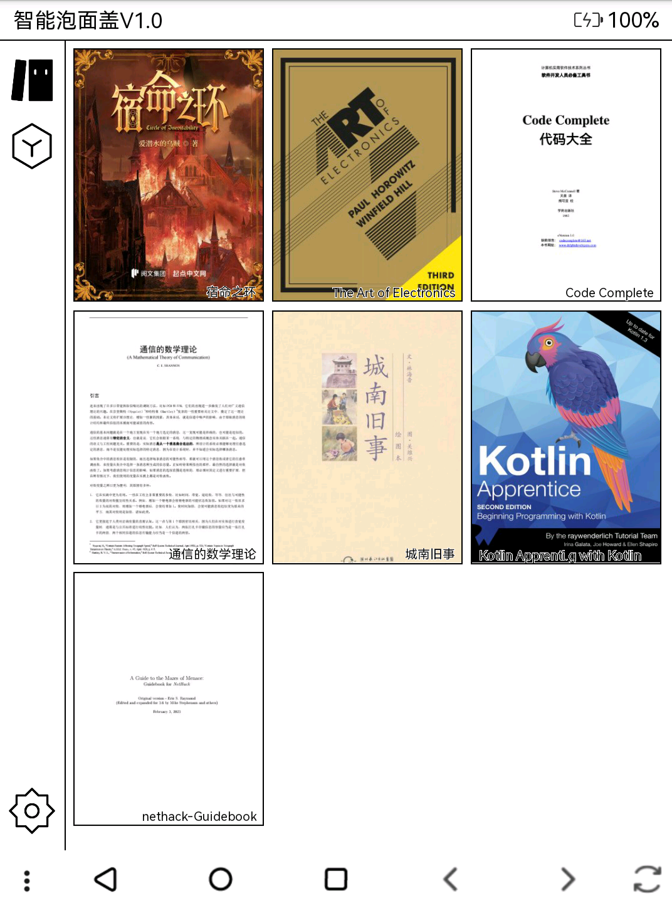
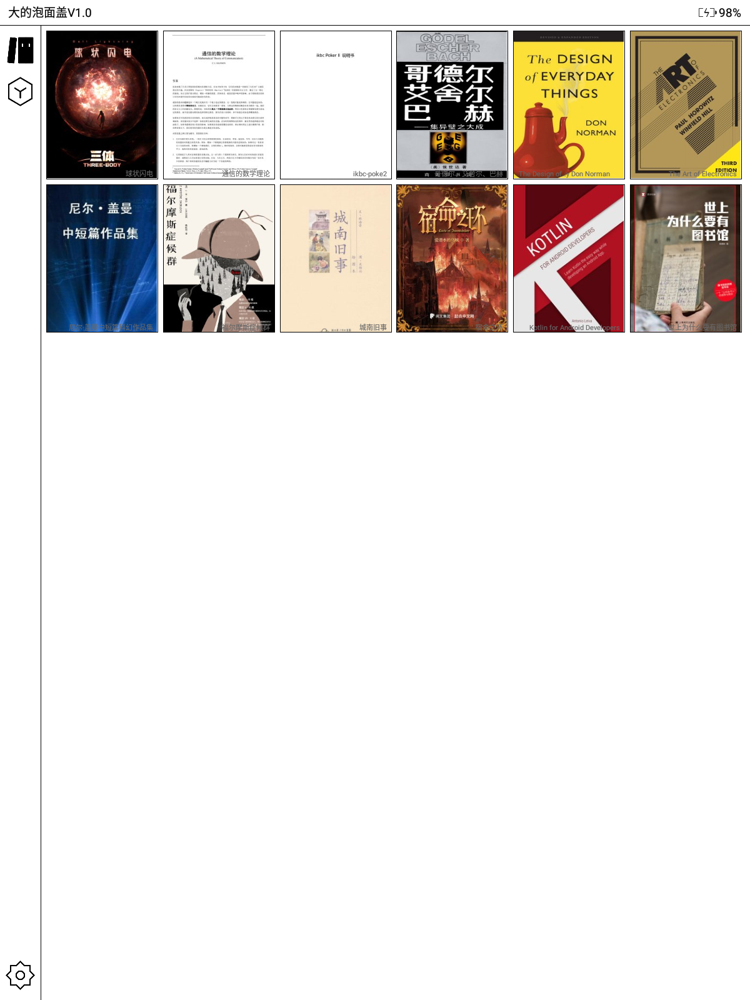
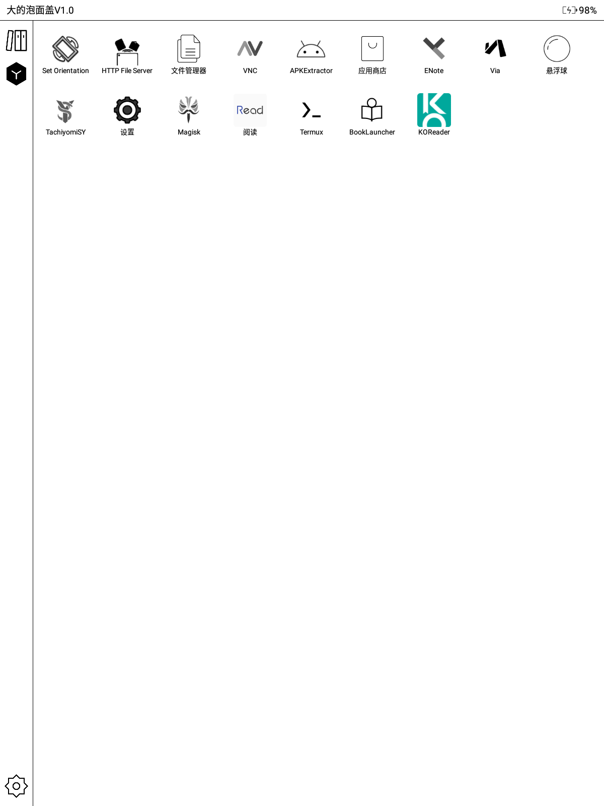

# BookLauncher [中文](./README.md)[English](./README-EN.md)

An Android launcher application focusing on Android e-ink screen readers.

## Build

Clone the project and set up the Android environment (JDK 8 and NDK 21.1.6352462).

First start the Metro server:

```bash
npm install
npm run start
```

Build the APK:

```bash
cd android
./gradlew assembleRelease
```

## Features

* Two Modes
  - Bookshelf Mode
      Displays a bookshelf page showing all EPUB and PDF books in the `/sdcard/Books` directory. (Why not support TXT? Because TXT files lack default covers. We recommend converting TXT to EPUB using [txt2epub](https://github.com/number317/txt2epub)). Shows book covers and titles. Clicking a book opens it with the [KOReader](https://github.com/koreader/koreader) app.
  - Simple Mode
      Displays only app names. Long-press the hour section in the clock to access settings.

* Custom app display: Configure hidden apps and sorting rules in settings. (Recommended to only show frequently used apps in Simple Mode)

* Automatic detection of book additions/removals
* Compatible with Android 4.4 and later

## Screenshots

* 6-inch Kindle with Crackdroid (Android 4.4)



* 10-inch Moaan InkPadX (Android 8.1)



## TODO

- [ ] Add default covers for books without detectable covers
- [ ] Make book-opening app configurable
- [ ] Support more book formats?
- [ ] Performance optimization? React Native apps consume more memory than native apps, which may not be ideal for a resident launcher.
