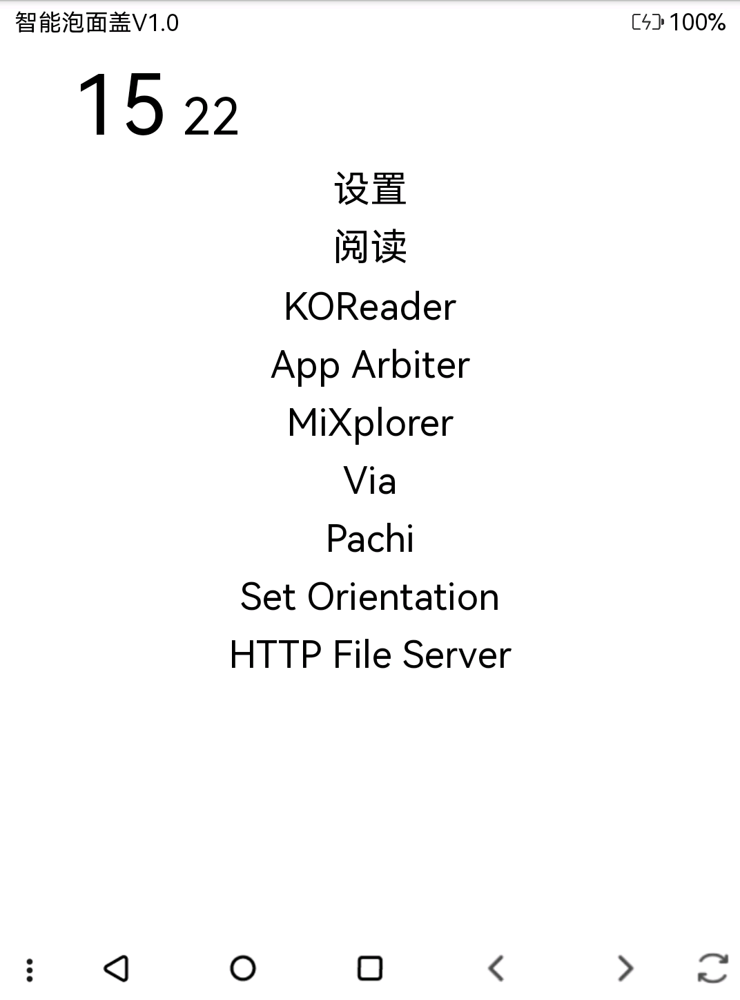
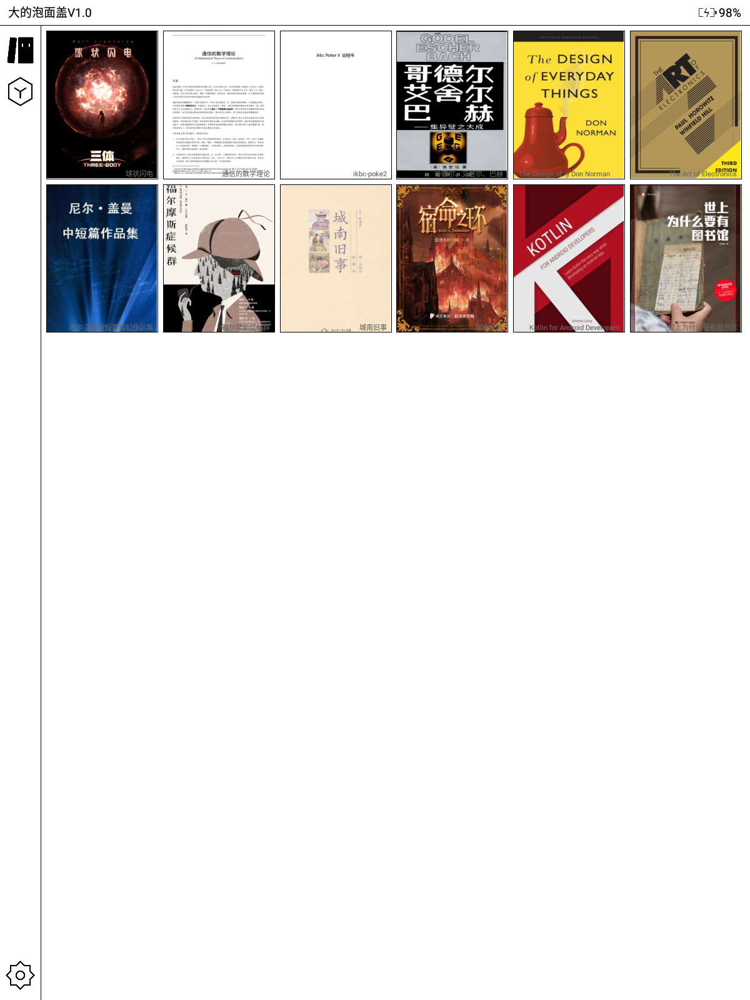

# BookLauncher [中文](./README.md)[English](./README-EN.md) 

这是一个 android 应用启动器，专注于 android 墨水屏阅读器。

## 构建

克隆项目，设置好 android 环境(JDK 8 和 NDK 21.1.6352462).

先启动 metro server:

```bash
npm install
npm run start
```

构建 apk:

```bash
cd android
./gradlew assembleRelease
```

## 功能

* 两种模式
  - 书架模式
      书架模式会有一个书架页，展示所有在 `/sdcard/Books` 目录下的 epub 和 pdf 书籍。(为什么不支持 txt？因为 txt 默认没有封面。建议将 txt 转换成 epub，关于如何转换，可以使用 [txt2epub](https://github.com/number317/txt2epub))并且展示他们的封面和名称。点击书籍会使用 [koreader](https://github.com/koreader/koreader) 阅读器打开书籍。
  - 简单模式
      简单模式只会展示应用名称。在这个模式下长按时间中的小时部分可以进入设置页面。

* 自定义应用展示：可以在设置中定义哪些应用隐藏，应用如何排序。(简单模式下建议只显示常用的应用)

* 自动检测图书的删除和添加
* 兼容低版本 Android4.4

## 应用截图

* 6 inch kindle with crackdroid (android 4.4)



* 10 inch moann inkpadx (android 8.1)



## TODO

- [ ] 给无法读取到封面的书籍添加默认封面
- [ ] 如何打开书籍作为可配置选择应用
- [ ] 支持更多书籍格式？
- [ ] 性能优化？react-native 开发的应用比原生应用要消耗内存，作为一个常驻启动器，可能不是很合适。

